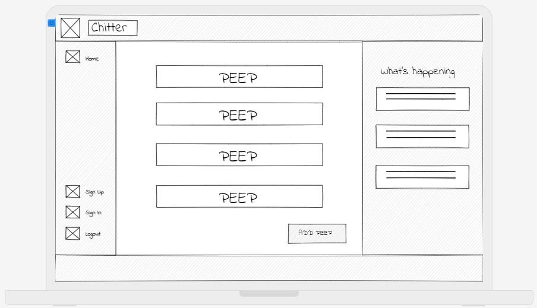
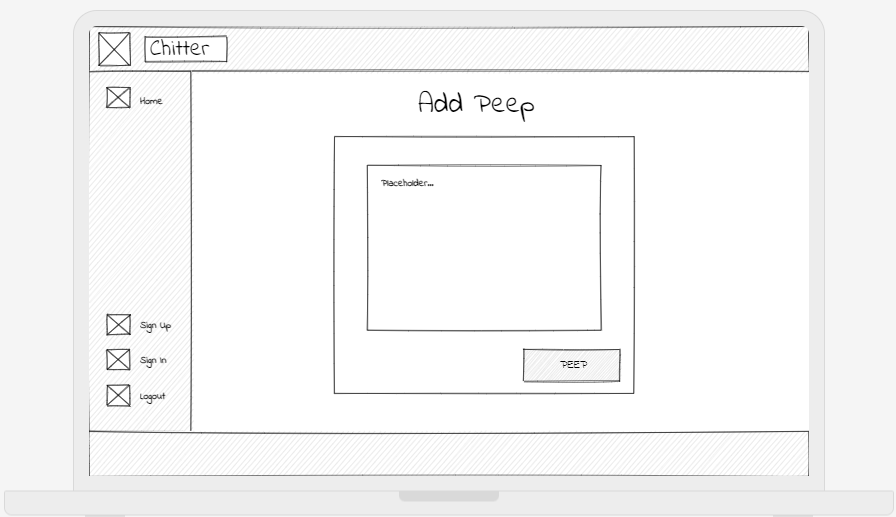
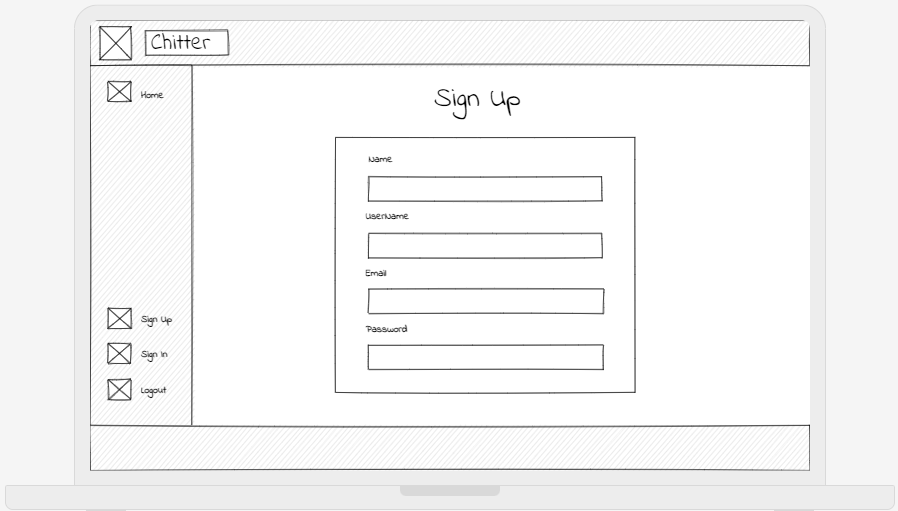
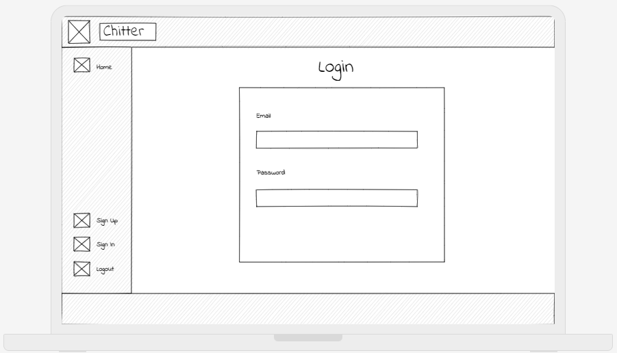
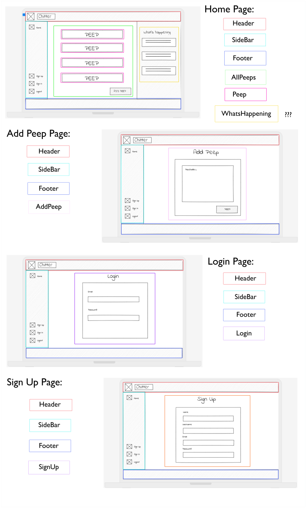
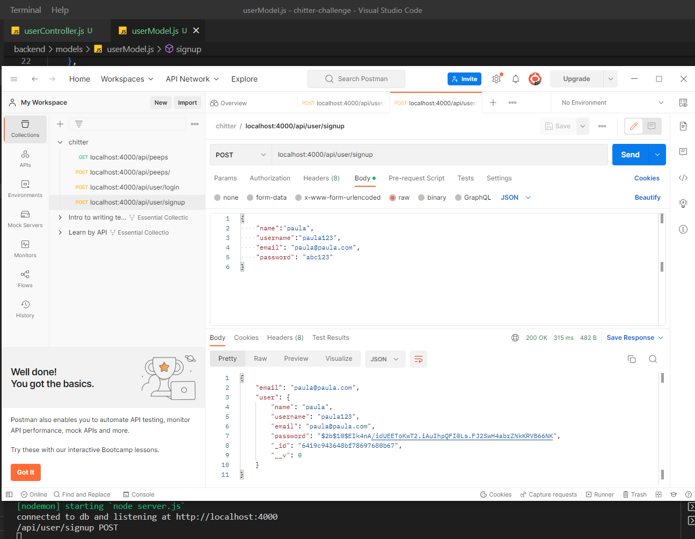

## INSTRUCTIONS
- I have used Vite so to run the frontend, use `npm run dev` 
- `npm test` as usual to run the tests for frontend
- Deployed link: `https://paulas-chitter-app.netlify.app/`

## WIREFRAMES

These are the wireframes for the four of views of my chitter app:

1. Home page listing all of the peeps

2. A page to add a peep
   
 

3. A sign up page
   

4. A login page
   

## COMPONENT HIERARCHY

- Header
- SideBar
- Footer
- AllPeeps
- Peep
- WhatsHappening
- AddPeep
- Login
- SignUp

## SOME RESOURCES
- date functions:  https://date-fns.org/v2.29.3/docs/format
- to validate password using express-validator: https://stackoverflow.com/questions/34760548/how-to-validate-password-using-express-validator-npm
- Set up the backend for testing: SE 2301-A REST APIs - TESTING 08032023 Livestream
- Frontend end testing using Vitest (alternative to jest for Vite): https://vitest.dev/guide/mocking.html
- set up vitest: https://www.youtube.com/watch?v=7f-71kYhK00
- Mern JWT step by step: https://www.youtube.com/playlist?list=PL4cUxeGkcC9g8OhpOZxNdhXggFz2lOuCT

## NOTES
### Frontend
- I was curious about Vite so I used this instead of Create React App. 
- All test files had to be .jsx to work.
- I used Vitest testing framework instead of Jest as Vitest is more compatible with Vite. There was more to configure at the start but after that it was mostly the same.
- I had to import vi from Vitest in every test file for the tests to work.
- I tried to do more testing of the async/await functions as per news challenge feedback
- As the real Twitter has a what's happening (trending) section I decided to re use the Guardian API to mimic this
- The UI is not currently responsive but this is something I will fix in the near future.
  
### Backend
- I was unable to successfully test the backend and ran out of time to figure it out!. I believe it has something to do with the mock data or the test database. I have left a few of the tests in although they are failing.
- I successfully managed to use postman to check requests:
  
